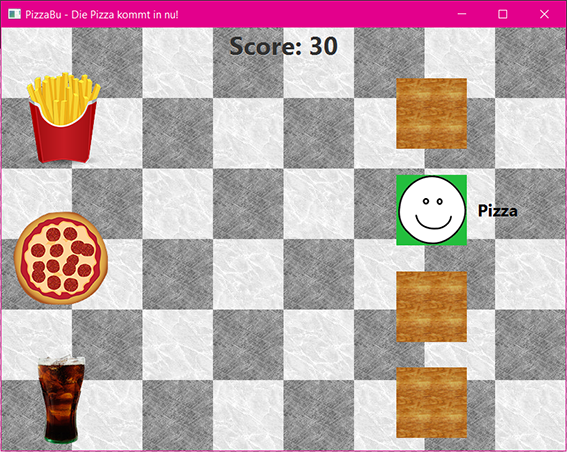

#PizzaBu - die pizza kommt in nu!
Final project of group 2
fhj.swengb.project.pizzabu

##Team Members

- Daniel Kandlhofer
- Markus Knaller
- Stefan Leitner
- Verena Skerbinz

##The Game

Just imagine, you are a pizza baker and you have to serve your guests pizza, coke and fries. 
But your guests are very impatient, and you have to handle four tables in a little amount of time. Very stressful situation. 
So, you don't believe me? Try it out! Play the game and you will see, how stressful this situation can be.

### The Start-Screen
 

In the Start-Screen there are four buttons. 
- Start
- Highscore
- Help
- Exit

###Game-Screen

A click on the Start-Button and you will assume the role of a stressed pizza baker.

###The Highscore-Screen

You are the best? Then you would probably find your name here! 

###The Help-Screen
You don’t know how to play the game? No problem, just read the Instructions provided on the Help-Screen.